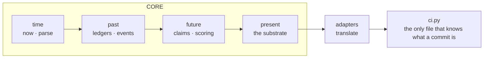
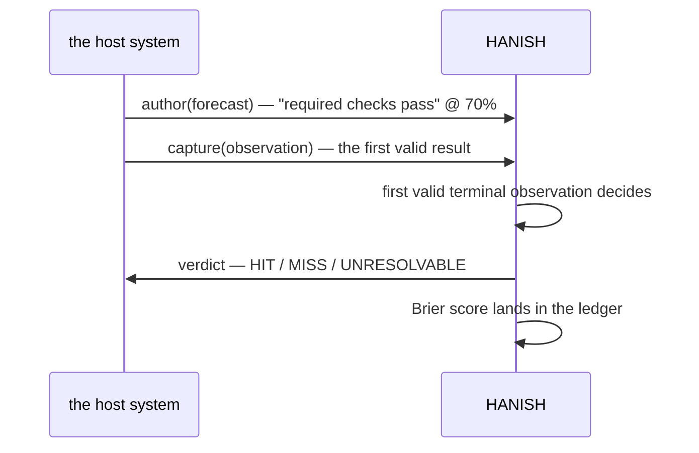
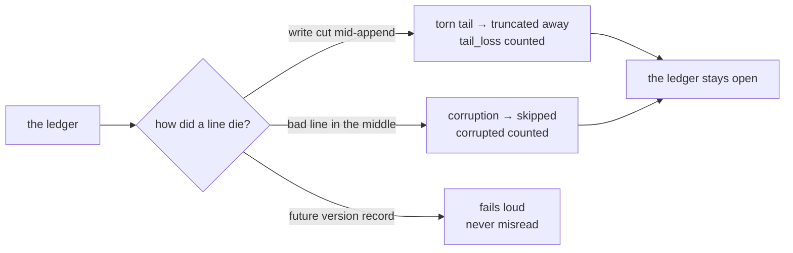

# HANISH

### A scoreboard for the future — written in stone, tuned by the present.

Hanish is a tiny piece of software that **writes predictions down, watches
what actually happens, and keeps score** — without ever letting a broken
recording or a missing answer turn into a lie.

Think of it as the smallest notebook that can't cheat itself.

```bash
python3 -m pytest tests/ -q      # v0.1.2 baseline: 41; the current suite must pass
python3 demo.py                  # three end-to-end scenarios, one read
```

---

## Plain English, no jargon

You're building something that depends on things *happening later* — a build
passing, a delivery arriving, a model being right.

So you **write the expectation down first**:

> *"The required checks on this commit will pass." — 70%*

Then the world runs. When the result arrives, Hanish **matches it against the
expectation** and writes the verdict next to it — hit or miss.

Then it does the one thing almost nobody does: **it keeps every piece of paper
forever, and it admits when it couldn't find one.** A missing answer is called
`UNRESOLVABLE` — never quietly marked as a miss. That distinction is the whole
point, and it's in the name of the game below.

**For the artist's eye:** think of Hanish as a *cognitive darkroom*. The ledger
is the negative — append-only, light-tight, never retouched. `BLIND` versus
`EXPOSED` isn't a metaphor: it *is* photography. `BLIND` requires complete,
disjoint accounts of who saw the forecast and who could move its target, plus
a named separation control and host attestation. Missing or uncertain proof
defaults to `EXPOSED`. An exposed image may be interesting, but it cannot count
as calibration.

---

## The shape of the system

One lattice, oldest to newest. **No layer looks up.** The past can feed the
future's vocabulary; the present composes them; adapters translate. A lower
layer never reaches for a higher one.



The `time` layer knows one thing: what *now* is. `past` is what happened,
`future` is what we claim, `present` is the machine that does the math.

## The loop — one forecast at a time



Nothing runs on a timer. **Resolution happens when someone asks** — `process()`
at a query, a flush, a finalizer. Idle for three weeks and nothing rots; the
next call drains the queue.

## The two directions, and why they must never swap

Confusing these two is how prediction systems rot.

```mermaid
flowchart TD
    subgraph OUTWARD["OUTWARD — the substrate never raises into its host"]
        A[malformed evidence arrives] --> B[counted, never thrown]
        B --> C[losing an observation is OK. breaking a build is not.]
    end
    subgraph INWARD — fail closed
        D[an observation is missing] --> E[UNRESOLVABLE]
        E --> F[never MISS. absence proves nothing without a seal.]
    end
```

The **completeness seal** is what makes the second one real. At a natural
boundary the host says *"this stream is finished, exactly N records."* Combined
with a per-source sequence number, a gap is detectable. Without a seal,
absence proves nothing — and Hanish says exactly that.

## The ledger — nothing is ever lost, nothing is ever faked

One record per line, appended with `fsync`, never edited, never deleted.
Everything else in the system is **derived** from these three files — so
restart is free: reopen and rebuild.

Damage is tolerated, counted, and surfaced — it never bricks a reopen:



A torn tail is a crash that cut a write in half — a physical accident. The
system shrugs, counts it, keeps going. And because records carry a schema
version, a record written by a *newer* Hanish fails loudly instead of being
silently misread by an older one.

## The identities — don't collapse them

Collapsing any two of these corrupts calibration.

| identity | answers | example |
|---|---|---|
| `source_ref` | who emitted it | `github-actions:JosephOIbrahim/Hanish` |
| `event_id` | which emission is this | `run-481:attempt-2:leg-python-3.13` |
| `subject_ref` | what it's about | `git:abc123` |
| `epoch_ref` | which bounded stream emitted it | repository + workflow + run + attempt |
| `world_ref` | what was known when authored | `world:sha256:<64 hex>` |

Two CI attempts on one commit are **two events about one subject** — not
duplicates. Only the first *valid* one scores. Retrying until green is the
largest calibration-laundering vector there is; Hanish records the retry and
does not let it rescore.

## The eight laws

A change that survives the harness answers to all eight:

1. **never-raise** — the substrate never throws into its host
2. **fail-closed** — incomplete evidence is `UNRESOLVABLE`, never `MISS`
3. **append-only** — a correction is a new record, never an edit
4. **domain-blind** — the core imports nothing from adapters
5. **adjudication precedes evidence** — the resolution spec is written first
6. **zero-dep** — no runtime dependencies, nothing to rot
7. **first-valid-terminal** — the first valid result decides
8. **exposure** — `EXPOSED` is never calibration data

## Health — three numbers

Separating these tells a real failure from a confusing one.

- **closure_rate** — did the bookkeeping actually finish?
- **scoreable_rate** — did we *learn* anything?
- **capture integrity** — accepted / duplicates / dropped / sealed epochs

## The frontier

Historical correction: the 20-role harness was a design and operator-driven
session, not an autonomous second host. Its first self-forecast,
`f_c57a1c3bc61f`, was labelled `BLIND` even though its author directed work
capable of moving the target gates. The evidence used a synthetic
`run_id="flight-past"`; CI did not autonomously capture it. The gitignored raw
root is unavailable, so Hanish does not invent its bytes, timestamps, or a
receipt. The append-only policy record in
`experiments/calibration-exclusions.jsonl` excludes it. The published
calibration corpus therefore contains zero eligible samples.

V0.2 turns the CI-compatible adapter into a real Host 0 path and publishes
verified, immutable receipts for authoritative runs. Its operational forecast
is deliberately `EXPOSED`: the first receipt proves capture and completeness,
not calibration.

## Deliberately absent

Not oversights. Each belongs to a later version; adding them now would freeze a
design nothing has run against yet.

`decay` · `calibration buckets` · `Brier aggregation` · `tiers` · `promotion` ·
`drift` · `model calls` · `distributed transport in the core` ·
`InterventionEvent` · USD

The prospective component formerly called **Prospect** is now **Hanish**.
Historical wave prompts retain the former name as quoted provenance. The
Moneta + Octavius + Hanish temporal ablation has not started.

## Next

- **V0.1** — done: the lattice, damage tolerance, cross-process once-only,
  schema versioning, never-raise.
- **V0.2** — trustworthy exposure, deterministic replay, bounded capture,
  autonomous Host 0, immutable receipts, and Host Ω adversarial conformance.
  **Hard gate: V0.3 cannot begin until every V0.2 gate is green.**
- **V0.3** — model-authored forecasts, sealed `BLIND` by construction. First
  publishable result.

---

[CHANGELOG](CHANGELOG.md) · [harness](/harness) · v0.1.2 baseline: 41 tests;
run the current gates for the live count
